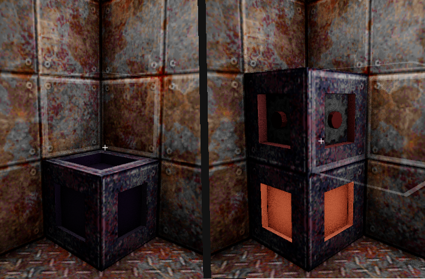

# range-voxel-tech-demo

## Getting Started

To run this project, you need the **Range Engine**.  
Get the latest version here:  
👉 https://rangeengine.tech/download

---

A 3x3 grid-based block placement system designed for building machines and managing an advanced item and machine progression system. Built with the **Range Engine**, this project demonstrates precise block placement mechanics alongside a tech tree for unlocking increasingly complex machines and items.

  

When a block is placed, the system checks whether the surrounding configuration matches any predefined machine blueprint. This check is **localized**: it only runs when a block is placed, and only around that specific block. This makes the system **modular, performant**, and **scalable**—ideal for large or infinite worlds.

  

Since detection always begins from the newly placed block, **rotations are naturally supported**. The system can identify valid machines in any orientation without needing to scan the full grid, making rotation handling **simple and efficient**.
