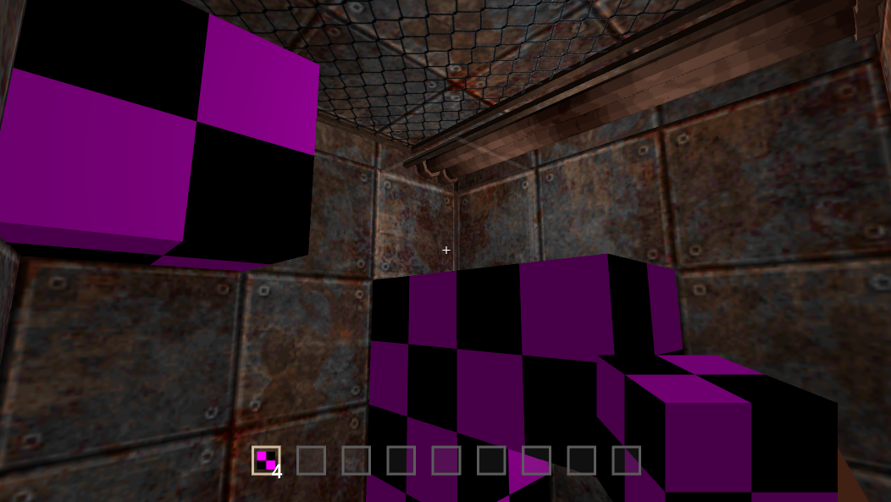

# range-voxel-tech-demo
A 3x3 grid-based block placement system designed for building machines and managing an advanced item and machine progression system. Built with the Range Engine, this project demonstrates precise block placement mechanics alongside a tech tree for unlocking increasingly complex machines and items.

